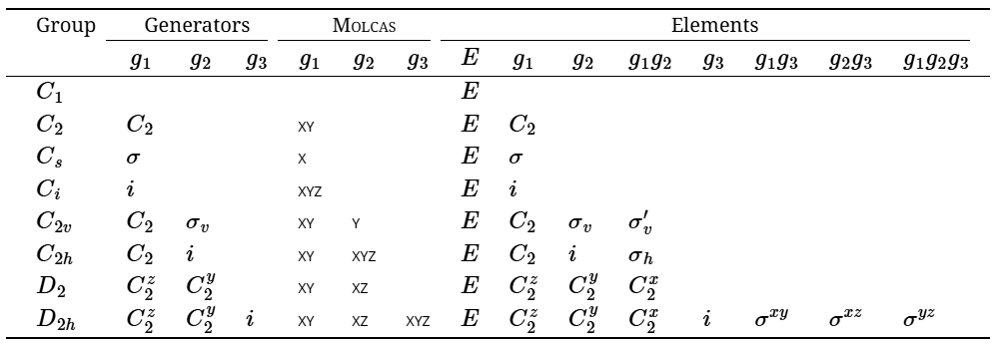

# 程序基本情况


# 环境变量

- `MOLCAS`：Molcas的主目录。
- `MOLCAS_MEM`：内存定义(以Mb为单位)，默认为1024。
- `MOLCAS_PRINT`：打印级别:`2`普通，`3`冗长
- `MOLCAS_PROJECT`：项目/文件使用的名称。
- `MOLCAS_WORKDIR`：中间文件的临时目录。

# EMIL命令

- 简短形式：

  ```
  > KEY [VALUE]
  ```

- 更完善的形式：

  ```
  >>>>>>>>>>  KEY  [VALUE]  <<<<<<<<<
  ```

  EMIL命令不区分大小写，但命令中使用的变量必须用大写字母。此外，在命令中的元素(单词)之间放置空格也很重要。

- `>> Do While`：开始循环
- `>> Foreach`：在输入文件中开始对若干项进行循环。
- `>> EndDo`：结束循环
- `>> If ( condition )`：
- `>> EndIf`：
- `>> Label Mark`：在输入中设置标签“Mark”。
- `>> Goto Mark`：向前跳转到标签“Mark”，跳过这部分输入。


----


- 如果在Molcas命令中使用`-f`标志，则日志文件将以ProjectName.log和ProjectName.err的名称存储在CurrDir目录中。

例子：

```
&GATEWAY
 coord=water.xyz
 basis=sto-3g
&SEWARD
&SCF
```


# `&GATEWAY`

- 收集有关分子系统的信息(几何、基集、对称性)，用于未来的计算。
- `&GATEWAY`是`&SEWARD`的一个子集，本模块的所有关键词也可以作为`&SEWARD`的输入，但为了清晰起见，可以将分子系统的信息作为本模块的输入。
- `&GATEWAY`不计算任何积分，因此必须<font color=red>跟着`&SEWARD`模块</font>的运行。`&GATEWAY`破坏通信文件`RUNFILE`，如果它与几何优化结合使用，它应该在优化循环之外运行。

例子：

```
&GATEWAY
Title= Water in C2v symmetry - A Tutorial
Coord = water.xyz
Group = XY Y
Basis Set = O.ANO-S-MB,H.ANO-S-MB
```

- 常用的关键词：

  - `TITLE`

  - `TEST`： `&GATEWAY`将仅处理输入并生成非零返回代码。
  - **`Coord`**

  - `EXPErt`

  - `BASDIR`

  - `BASLIB`
  - **`BASIs Set`**
  - **`Group`**
  - `SYMMetry`
  - `RICD`：动态辅助基组

  - `RTRN`

  - `ISOTopes`

  - `ECPShow`：强制 `&GATEWAY`打印ECP参数

  - `AUXShow`：强制 `&GATEWAY`打印辅助基组参数

  - `BSSHow`：强制 `&GATEWAY`打印基组参数

  - `VERBose`：强制 `&GATEWAY`打印更详细的内容。


- **`&GATEWAY`的输出：**
  - 包含对称字符表、基组信息和输入原子中心。基组信息列出了指数和收缩系数以及所使用的高斯函数的类型（笛卡尔函数、球函数或污染函数）。
  - 核间距离和价键角（包括二面角）显示在基组信息之后。惯性和刚性转子分析也与定时信息一起包含在输出中。
  - 对于确定 Molcas 模块 SCF 的输入有用的输出部分是对称自适应基函数，它出现在输出的 `&GATEWAY` 部分末尾附近。 SCF 教程对此进行了更详细的介绍。
  - `&GATEWAY` 模块生成的最重要的文件是 `RUNFILE`，是用于在各个 Molcas 程序模块之间传输数据的通用 Molcas 通信文件。许多程序模块将数据添加到  `RUNFILE` 中，这些数据可以在其他模块中使用。每次运行 `&GATEWAY` 时都会生成一个新的  `RUNFILE`。最后应该提到的是，为了向后兼容，可以在不调用 `&GATEWAY` 的情况下运行 MOLCAS。然后相应的输入和输出将由程序 `&SEWARD` 处理。

## 几何、对称性和基组

一共有三种方式指定

###  Z-matrix and XYZ input

有时，以标准形式的 Z 矩阵或笛卡尔坐标设置坐标信息会更方便。在这种情况下，原子的基组应在 `XBAS` 关键字之后指定。之后，应出现 `ZMAT` 或 `XYZ` 来指定坐标。请注意，这些格式中的坐标使用 ångström 作为单位。

- 基组`XBAS` 例子：

  ```
  XBAS=STO-3G
  ```

  或

  ```
  XBAS
  C.STO-3G
  H.STO-3G
  End of basis
  ```

- Z矩阵 `ZMAT` 形式例子：

  ```
  ZMAT
  C1
  O2      1   1.40000
  C3      1   1.45000   2   109.471
  H4      1   1.08900   2   109.471     3   120.000
  Cl5     1   1.75000   2   109.471     3  -120.000
  H6      2   0.94700   1   109.471     3   180.000
  H7      3   1.08900   1   109.471     2   180.000
  H8      3   1.08900   1   109.471     7   120.000
  H9      3   1.08900   1   109.471     7   240.000
  End of z-matrix
  ```

- 笛卡尔坐标形式 `XYZ` 例子

  ```
  XBAS=STO-3G
  XYZ=$CurrDir/Water.xyz
  ```

  或

  ```
  XBAS=STO-3G
  XYZ
  1
   note angstrom units!
  C 0 0 0
  ```

  - `XYZ` 关键字不进行对称操作，并且计算始终在不对称的情况下执行。

### Advanced XYZ input

- 默认单位是Å。默认情况下，使用最大可能的对称性。

- Molcas的xyz文件形式：

  - 第一行包含原子的数目。
  - 第二行（注释行）可以包含“a.u.”或“bohr”使用原子单位，而不是默认的ångströms。此行还可以包含关键字 `TRANS`，后跟 3 个数字和/或 `ROT`，后跟 9 个数字（在这种情况下，坐标将由指定向量平移和/或旋转）和 `SCALE`（或 `SCALEX`、`SCALEY`、`SCALEZ`）随后是比例因子。
  - 其余的行用于指定元素和笛卡尔坐标。
    - 元素名称后面可以选择**跟随数字**（例如 H7）、标签（**用 _ 分隔**：例如 H_INNER）或基组（**用 . 分隔**，例如 H.STO-3G）

- `BASIS`：单个实例限制为80个字符，但关键字可以多次给出

- 例子：

  ```
  COORD
  4
  
  C           0.00000 0.00000 0.00000
  H           1.00000 0.00000 0.00000
  H           0.00000 1.00000 0.00000
  H           0.00000 0.00000 1.00000
  BASIS
  STO-3G, H.6-31G*
  ```

  或

  ```
  BASIS
  STO-3G
  BASIS
  H.6-31G*
  ```

- `GROUP`：后面可以跟随

  - `FULL `：默认，用D2h可能的最大子群
  - `NOSYM `：等同于`E`或者`C1`
  - 空格分隔的对称元素列表：比如` X XY`，Molcas支持的对称性和生成器列表如下：

  

- 默认情况下，分子的坐标可能会发生变化去保持最高对称性，比如以下的水分子在C2v对称性的阈值中，坐标就会被转换。

  ```
  &gateway
  coord
  3
  
  O 0 0 0
  H 1.0000001 0 0
  H 0 1 0.0000001
  *nomove
  *group=c1
  ```

  - 如果激活了`nomove`，分子就不会被旋转，xy对称面是唯一的对称元素，H原子的位置也会略微改变
  - 如果激活了`group=c1`，几何才会完全不变。

### Native input

- 默认单位是原子单位

- `SYMMetry`：对称元素列表，默认没有对称性

- `BASIs Set`：下一行始终包含基组标签，始终以`End of Basis`结束

  - 

  - 例子：

    ```
    &GATEWAY
    Title
    formaldehyde
    SYMMETRY
    X Y
    Basis set
    H.STO-3G....
    H1           0.000000    0.924258   -1.100293 /angstrom
    End of basis
    
    Basis set
    C.STO-3G....
    C3           0.000000    0.000000   -0.519589 /angstrom
    End of basis
    
    Basis set
    O.STO-3G....
    O            0.000000    0.000000    0.664765 /angstrom
    End of basis
    
    End of input
    ```

- 其他关键词：

  - `SYMThreshold`：后跟一个实数 — 对称识别的阈值（默认为 0.01 Å）

  - `CSPF`

  - `MOVE`：允许平移和旋转分子以找到最高可能的对称性。除了C1，对所有对称性都是默认的。

  - `NOMOVE`：不允许在搜索最高组时转换坐标，C1是默认的

  - `BSSE`：`&GATEWAY`可以处理多个坐标文件，方便计算BSSE校正量。`BSSE`后面跟着一个数字，这标志着XYZ文件应该被视为虚拟原子。例如：

    ```
    &GATEWAY
    coord = ethanol.xyz
    coord = water.xyz
    bsse  = 1
    basis = ANO-S-MB
    NOMOVE
    &SEWARD; &SCF
    &GRID_IT
    NAME = water
    ***************
    &GATEWAY
    coord = ethanol.xyz
    coord = water.xyz
    bsse  = 2
    basis = ANO-S-MB
    NOMOVE
    &SEWARD; &SCF
    &GRID_IT
    NAME = ethanol
    **************
    &GATEWAY
    coord = ethanol.xyz
    coord = water.xyz
    basis = ANO-S-MB
    NOMOVE
    &SEWARD; &SCF
    &GRID_IT
    NAME = akvavit
    ```

  - `VART`
  - `VARR`
  - `NUMErical`：即使解析梯度可用，也强制计算数值梯度。
  - `SHAKe`：

## 基组

- Molcas 的基组库包含一组广泛的基组，包括segmented和generally收缩基组。
  - Molcas自带基组基于原子自然轨道 (ANO) 概念，并标记为 ANO-X（X=S、L 或 RCC）。
  - 专门为计算分子电特性（POL）而设计的第四基组。
- 除此之外，还包括segmented标准基组的子集，如STO-3G、3-21G、4-31G、6-31G、6-31G*、6-31G**、cc-pVXZ (X=D,T,Q)、aug-cc-pVXZ (X=D,T)。
- 还包含Turbomole RI基组的不同变体。
- 所有基组都存储在 `basic_library` 目录中。可以在此目录中的文件 `basictype.tbl` 中找到不同类型的可用基组。文件 `basic.tbl` 中列出了名称的别名。
- <font color=red>找出可用的基组的最佳方法是发出命令 `pymolcas help_basis X`，其中 X 是原子。</font>
  - 请注意，速记符号可用于大多数基组：例如 ANO-L-VTZP 将给出具有偏振函数的价三重 zeta 精度的基组。

---

- ANO-S：最小的原子自然轨道 (ANO) 基组可用于原子 H–Kr。

- ANO-L：原子 H-Zn（不包括 K 和 Ca）

  - 建议至少使用两个极化 (3d/4f) 函数，因为**其中一个用于极化，第二个用于相关**。如果仅使用一个 3d/4f 型函数，则必须决定其用途并相应地调整指数和收缩。这里，这两种效应由前两个 3d/4f 型 ANO 共同描述（对于氢 2p 型 ANO 也是如此）。

- ANP-RCC：用于原子 H–Cm，只能用于包含标量相对论效应的计算。

  - 当使用这些基组时，`&Seward` 将自动识别这一点并打开 `DK` 选项

  - 输入文件中的写法是:

    ```
    Atom.ANO-RCC…contracted set. (Note the last dot!).
    Atom.ANO-RCC-label, where label is one of MB, VDZ, VDZP, VTZP, or VQZP.
    ```

## 辅助基组

所谓的身份解析 (RI) 技术（也称为密度拟合，DF）是在 Molcas 包中实现的。此选项涉及在 2 电子积分的有效计算中使用辅助基组。 Molcas 结合了传统计算、外部提供的辅助基组（RIJ、RIJK 和 RIC 类型）以及即时生成的辅助基组（on-the-fly generated auxiliary basis sets）的使用。后者是基于 Cholesky 分解方法（Cholesky decomposition method）的 atomic CD (aCD) 或atomic compact CD (acCD) 基组。外部提供的辅助基组非常紧凑，因为它们是为特殊波函数方法量身定制的。然而，它们并未针对所有可用的价基组提供。 aCD 或 acCD RI 辅助基组是更通用的选项，为任何波函数模型和价基组提供辅助基组。

- <font color=red>如果 `MOLCAS_NEW_DEFAULTS` 设置为 `YES`，acCD RI (RICD) 将默认启用，可以通过 `NOCD` 禁用</font>。
- 也可以直接在`&GATEWAY`中使用`RICD`关键词

## 其他

- 请注意，要使用**虚原子**，用户应使用基组标签“`X....`”。这将意味着没有电荷也没有基函数。

- 坐标文件可能包含变量，例如：

  ```
  >>FILE H2.input
  2
  scale $DD
  H 0.35 0 0
  H -0.35 0 0
  >>EOF
  
  >> FOREACH DD IN ( 0.9 1.0 1.1 )
  &GATEWAY
  COORD=$WorkDir/H2.input
  BASIS=STO-3G
  &SEWARD
  &SCF
  >>ENDDO
  ```

- XYZ文件中的原子名可以包含一个轨道标签(以简化不同基组的分配)。比如：

  - `C_SMALL`，然后再`BASIS=C_SMALL.ANO-S-MB`. 也可以直接：

  ```
  COORD
  1
  
  O.ANO-S-VDZP 0 0 0
  ```

- XYZ文件也可以包含有关点**电荷**的信息。在 XYZ 文件中设置原子电荷有三种可能性：

  - 主要的选择是使用`Q`作为元素名称，应该指定第四个数字，即电荷
  - 另一种可能是使用以负号结尾的元素名，使用元素的形式电荷，比如：
    - `H-`， Li-， `Na-`， `K-`定义+1
    - `Mg-`、`Ca-`定义+2
    - `Al-`定义+3
    - `C-`、`Si-`定义+4
    - `F-`、`Cl-`、`Br-`、`I-`定义-1
    - `O-`、`S-`定义-2

  - 在XYZ文件- `CLUSTER`的注释行上加上一个标签，后面跟着一个整数，可以指定有多少原子是“真实的”，因此其余的原子将被视为带有该元素默认值的电荷。

# `&SEWARD`

- `&SEWARD`模块生成所需的单电子和双电子积分
- 除了标准输出文件外，`&SEWARD`还可以生成以下文件：ONEINT、ORDINT、CHVEC、CHRED、CHORST、CHOMAP、CHOR2F，
  - 比如` $Project.OneInt`和`$Project.OrdInt `（这仅适用于非 Cholesky 类型的计算）
  - ONEINT 文件包含单电子积分。 ORDINT 包含有序且压缩的二电子积分。
  - 。

# `&SCF`

- Molcas 实现执行闭壳层（所有电子在轨道中配对）和开壳层（无限制 Hartree-Fock）计算。如果没有给出输入，程序将计算中性分子的 SCF 能量，其中轨道占据给出最低能量。
  - 闭壳层计算一般不需要其他关键词
  - `UHF`计算
    - 可以将 UHF 与关键字 `Charge` 或 `Aufbau` 一起使用，指定关键字 `ZSPIN` 。
- 无法使用 SCF 执行受限开壳 Hartree–Fock (ROHF) 计算。这是使用 RASSCF 程序来完成的。
- SCF 程序还可用于使用 Kohn Sham 密度泛函理论 (DFT) 执行计算。要进行密度泛函理论计算，


## 输出

会输出以下文件：

- `SCFORB`：SCF 轨道输出文件。包含用于闭壳计算的规范 Hartree-Fock 轨道。可以在后续的 Molcas 模块中使用。
- `UHFORB`：开壳层计算的正则 Hartree-Fock 轨道。
- `UNAORB`：UHF计算的自然轨道
- `MD_SCF`：用于分子轨道分析的 Molden 输入文件。

## DFT计算

- 关键字 `KSDFT` 必须在下一行中紧跟输入部分中列出的可用泛函名称。目前提供以下功能关键字：BLYP、B3LYP、B3LYP5、HFB、HFS、LDA、LDA5、LSDA、LSDA5、SVWN、SVWN5、TLYP、PBE、PBE0、M06、M06HF、M062X、M06L。例子：

  ```
  KSDFT= B3LYP5
  
  KSDFT=HYB_GGA_XC_B3LYP      * A Libxc functional name
  
  KSDFT=5                     * Five components with their weights
        0.20 HF_X             * Keyword for exact exchange
        0.08 XC_LDA_X         * Libxc functional names
        0.72 XC_GGA_X_B88     *  .
        0.19 XC_LDA_C_VWN_RPA *  .
        0.81 XC_GGA_C_LYP     *  .
  ```

- `pymolcas help_func`查看都有哪些泛函可用

## 电子结构指定

###  `ZSPIN` 

- 设置为 alpha 和 beta 电子之间的差异

### `CHARge`

使用该关键字设置系统中的电子数。该数字是通过给出系统的净电荷来定义的。如果未指定此关键字，则假定分子的净电荷为零。

```
Charge=n
```

### `OCCUpied`

- 使用该关键字设置系统中的电子数。通过给出D2h子群的每个不可约表示的电子对数量来定义的 

- `OCCUpied`和`charge`可以只用一个，如果都没有默认电荷为0

- 指定此关键字时，不会使用“Fermi aufbau”过程。

- 例：

  ```
  OCCUpied= n1 n2 n3 n4
  ```

  - n1代表第一个不可约表示占据轨道上的电子对数
  - 如果指定了 `UHF` 关键字，则必须在两行中指定`OCCUpied`

### `OCCNumbers`

- 可以指定0和2之外的占据数，对于生成开壳情况的起始轨道非常有用。对于`UHF`计算要指定两条

- 例：

  ```
  &SCF
  TITLE
   NiH G.S.
  OCCUPIED
   8 3 3 1
  OCCNumber
  2.0 2.0 2.0 2.0 2.0 2.0 2.0 2.0
  2.0 2.0 2.0
  2.0 2.0 2.0
  1.0
  ```

### `SCRAmble`

对于开壳层单重态可能比较有用，默认值为0.2，表最大的旋转角为arcsin 0.2。

### `IVO`

指定要改进虚拟轨道以用于后续 MCSCF 计算。核心哈密顿量在虚拟轨道子空间内对角化，从而产生尽可能紧凑的轨道，但约束条件是它们必须与占据的轨道正交。请注意，每当 Hartree-Fock 波函数本身用作后续计算中的参考时，不得使用此选项。比如MP2或者CC计算等。

## 初猜

### `LUMOrb`

- 如果没有其他说明，SCF 程序将使用 SEWARD 生成的猜测轨道作为输入轨道，内部名称为 `GUESSORB`
- 如果想要为 SCF 程序使用任何其他输入轨道，则必须使用选项 `LUMOrb`。相应的文件应复制到内部文件`*.INPORB`。即：起始向量取自先前名为 INPORB 的 SCFORB 文件。
  - 比如：这可以是由早期 SCF 计算 $Project.ScfOrb 生成的轨道文件。只需将文件复制或链接为 `*.INPORB`。

### `FILEORB`

- 起始向量取自用户指定的先前 SCFORB 文件。

## 打印

- `PRORbitals`：指定要在日志文件（标准输出）中打印哪些轨道。默认是1。
  
  - `0`：不打印任何轨道
  
  - `1`：打印轨道能量小于$$2E_{HOMO}-E_{LUMO}$$的
  
  - `2`：后面接实数(ThrEne);轨道能量小于ThrEne的轨道被打印出来。
  
  - 第二个（可选）参数指定格式：对于少量 MO，默认值为 3；对于 MO 数量 > 256，默认值为 2。
  
    - `0`：不打印
    - `1`：仅打印单电子能量和占据数
    - `2`：短打印格式
    - `3`：扩展打印格式
  
    ```
    Prorbitals 
    2 1.d+10
    ```
  
    

# `&MBPT2`-MP2计算

- `FREEze`：指定冻结占据轨道的总数。然后自动识别并冻结能量最低的占据轨道。该关键字采用一个整数作为参数。与 `FROZen` 关键字不兼容。
- `FROZen` ：指定表示系统的 D2h 子群的每个不可约表示 (irreps) 中冻结占据轨道的数量。与 `FREEze` 关键字不兼容。默认是冻结非价轨道。
- `sFrozen`：指定特定的冻结轨道。第一行代表Frozn中的，后面几行代表每个对称性冻结的哪个轨道。

例子：

```
&MBPT2
Title
 H2O:  O(9.5/4.2), H(4/2)
* The lowest energy occupied orbital in the repr. no.1 will be frozen in
* MBPT2 calculations. The number of representations is 4 and all zeros
* must be explicitly given
Frozen
1 0 0 0
* Two highest energy external orbitals in the repr. no.3 will be deleted
* in MBPT2 calculations. The number of representations is 4 and all
* zeros must be explicitly given
Deleted
0 0 2 0
* One occupied orbital in symmetry no.1 will be additionally frozen by
* using the SFRO option. Let it be the third SCF occupied orbital in
* this symmetry
sFrozen
1 0 0 0   // Gives the number of frozen orbitals in each symmetry
3         // Gives the frozen orbital reference number in symmetry no. 1
* Two external orbitals in symmetry no.1 and one external orbital in
* symmetry 3 will be deleted. In symmetry 1 let it be the second and
* third external orbitals, and in symmetry 3 the third (already deleted
* in by using the option DELE) external orbital
sDeleted
2 0 1 0   // Gives the number of orbitals to be deleted in each symmetry
2 3       // Gives the reference numbers of external orbitals in sym. 1
3         // Gives the reference number of the external orb. in sym. 3
```

